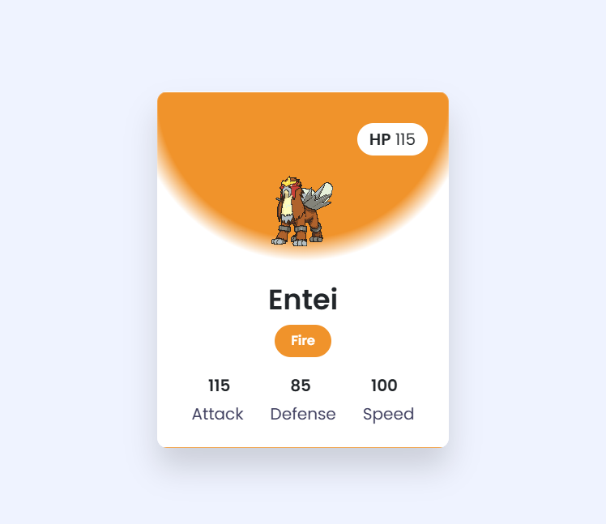

# Pokédex Web App

A lightweight, stylish Pokédex web application built with Node.js, Express, and
EJS that allows users to search for any Pokémon and view detailed information
such as stats, types, and images — all powered by the
[PokéAPI](https://pokeapi.co/).

## 🚀 Features

- 🔎 Search for any Pokémon using a dynamic autocomplete input.
- 📄 View key information: type, base stats, and official artwork.
- 🎨 Beautiful, responsive Pokémon card design with hover effects.
- 🌈 Dynamic type-based coloring using JavaScript.
- 📱 Mobile-friendly and responsive layout using Bootstrap 5.

## 🛠 Tech Stack

- **Backend**: Node.js + Express
- **Templating**: EJS
- **Styling**: Bootstrap 5 + Custom CSS
- **Data Source**: [PokéAPI](https://pokeapi.co/)

## 📦 Installation & Usage

1. **Clone the repository**:
```bash
git clone https://github.com/JoshuaVanStraaten/full-stack-course.git
cd "6.0 Capstone Project 4 - Pokedex"
```

2. **Install dependencies**:
```bash
npm i
```

3. **Run the app**:
```bash
# Ensure you have nodemon installed, otherwise just use node
nodemon app.js
```

Visit http://localhost:3000 in your browser.

## ✨ Screenshots
<p align="center">  </p>

## 🙌 Credits
[PokéAPI](https://pokeapi.co/) for the rich and free Pokémon data.
